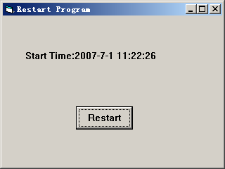

## Restart program by code

### Description

This program demonstrates how to restart the programe follow code but not external .
 
### More Info
 

             |
---                |---
**Submitted On**   |2007-06-30 23:30:02
**By**             |[Habin](https://github.com/Planet-Source-Code/PSCIndex/blob/master/ByAuthor/habin.md)
**Level**          |Beginner
**User Rating**    |4.8 (24 globes from 5 users)
**Compatibility**  |VB 5\.0, VB 6\.0
**Category**       |[Coding Standards](https://github.com/Planet-Source-Code/PSCIndex/blob/master/ByCategory/coding-standards__1-43.md)
**World**          |[Visual Basic](https://github.com/Planet-Source-Code/PSCIndex/blob/master/ByWorld/visual-basic.md)
**Archive File**   |[Restart\_pr2073426302007\.zip](https://github.com/Planet-Source-Code/habin-restart-program-by-code__1-68914/archive/master.zip)

